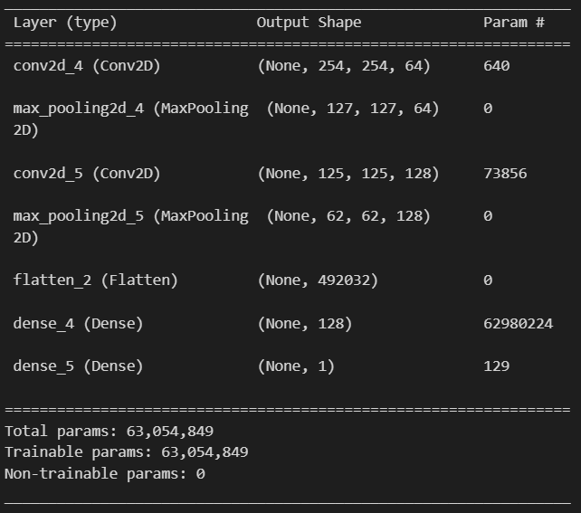

# **Predicción de Neumonía**

-----
### Este proyecto va a consistir en el análisis, exploración de datos y creación de un modelo de red neuronal convolucional para la predicción de una neumonía en un paciente basándonos en una imagen de rayos x. Para ello se han usado diferentes herramientas y librerías enfocadas a las redes neuronales convolucionales.


-----

### Organización de carpetas: 

* scr/
    * data/: Contiene los archivos usados en el proyecto.
    
    * Images/: Contiene imágenes usadas en este archivo Markdown.

    * Model/: Contiene los modelos realizados en el proyecto.

    * notebooks/: son archivos jupyter notebook usados en todo el proceso.

------

### Fuente: [Kaggle](https://www.kaggle.com/datasets/paultimothymooney/chest-xray-pneumonia)

------

### En este proyecto de pueden apreciar conocimientos en:

* Python
* Deep Learning
* Keras
* TensorFlow
* ImagineProcessing
* Computer Vision
* Supervised Learning
* Classifier Models

------

## **Importación de los datos**

#### Leemos todas las imágenes de con las que vamos a entrenar a nuestro modelo y que corresponden a imágenes de pacientes sanos. También cambiamos el tamaño de todas las imágenes para que tengan el mismo.

```py
lista_normal = []
lista_neumonia = []
for x in os.listdir("../data/chest_xray/train/NORMAL/"):
    img = imread(os.path.join("../data/chest_xray/train/NORMAL/", x))
    lista_normal.append(cv2.resize(img, (256, 256)))
```
#### Comprobamos que la forma de todas las imágenes es la misma y en blanco y negro ya que si hya algunas a color y otras en blanco y negro nos dará un error al no tener la misma forma todas las imágenes.
```py
set_normal= set()
for elemento in lista_normal:
    set_normal.add(elemento.shape)
set_normal
output: {(256, 256)}
```
#### Hacemos lo mismo de antes con las imágenes de persona con neumonía.
```py
for x in os.listdir("../data/chest_xray/train/PNEUMONIA/"):
    img = imread(os.path.join("../data/chest_xray/train/PNEUMONIA/", x),as_gray=True)
    lista_neumonia.append(cv2.resize(img, (256, 256)))
set_neumonia = set()
for elemento in lista_neumonia:
    set_neumonia.add(elemento.shape)
set_neumonia
output: {(256, 256)}
```
#### Imagen de ejemplo


## Transformación de datos
#### Transformamos las listas a arrays.
```py
array_normal = np.array(lista_normal)
array_neumonia = np.array(lista_neumonia)
```
#### Creamos un dataframe con las etiquetas correspondientes a cada imagen y unimos los arrays anteriores.

```py
data = data.append(pd.DataFrame({"target":np.full(array_normal.shape[0], 0)}))
data = data.append(pd.DataFrame({"target":np.full(array_neumonia.shape[0], 1)}), ignore_index=True)
x = np.concatenate((array_normal, array_neumonia))
y = data["target"]
```
#### Escalamos los datos.
``py
x = x/255
``

## Creación de la red neuronal convolucional
#### He elegido crear dos capas de la red convolucional con 2 pooling layers. La activación que he elegido ha sido relu para las capas de entrada y las capas ocultas y sigmoide para la capa de salida ya que va a ser un modelo de clasificación binaria. De optimizador he elegido Adam, de función de pérdida binary_crossentropy ya que es una clasificación binaria y de metrica como función de pérdida accuracy. En la primera capa de la red convolucional aplicamos 64 filtros en un rango de 3x3 píxeles, luego le cambiamos la resolucion. En la tercera capa aplicamos 128 filtros en un rango de 3x3 píxeles y la red convolucional termina con una minimización en su resolución para luego aplanar los datos y meterlos en una red neuronal con 128 neuronas en la capa de entrada y una en la salida ya que queremos que nos devuelva solo un valor binario(1 o 0).
```py
layers = [
    keras.layers.Conv2D(64, (3,3), activation='relu', input_shape=(256,256, 1)),
    keras.layers.MaxPooling2D(pool_size=(2,2)),
    
    keras.layers.Conv2D(128, (3,3), activation='relu'),
    keras.layers.MaxPooling2D(pool_size=(2,2)),
    
    keras.layers.Flatten(),
    keras.layers.Dense(128, activation='relu'),
    keras.layers.Dense(1, activation='sigmoid')
]

model = keras.Sequential(layers)
model.compile(optimizer = 'adam',
             loss = 'binary_crossentropy',
             metrics = ['accuracy'])
```

## Entrenamiento de la red

#### Barajamos los datos y entrenamos el modelo

```py
xtrain = shuffle(x, random_state = 42)
ytrain = shuffle(y, random_state = 42)

history = model.fit(xtrain,
    ytrain,
    batch_size = 128,
    epochs = 20,
    validation_split = 0.2
)
```

## Evaluación del modelo

#### Realizamos todas las operaciones realizadas a los datos pero esta vez a los datos de test y evaluamos el modelo.

```py
model.evaluate(x_test, y_test)
output: [2.854746103286743, 0.7371794581413269]
```
#### Recordemos que la métrica era accuracy así que su valor es 0,73. es decir, de todas las muestras a predecir, hemos predicho el 73% correctamente.

#### Vamos a ver otras métricas.

```py
print ("Accuracy:",metrics.accuracy_score(y_test, predict.round()))
print("Recall:" , metrics.recall_score(y_test, predict.round()))
print("Recall:", metrics.precision_score(y_test, predict.round()))

output: 
Accuracy: 0.7371794871794872
Recall: 0.9948717948717949
Precission: 0.7054545454545454
```

#### La métrica Recall nos indica que, de todos los pacientes con neumonia, hemos clasificado bien al 99%. La métrica de Precission nos infica que, de los que hemos predicho como pacientes con neumonía, hemos acertado el 70%. Vemos que nuestro modelo predice muy bien a los pacientes con neumonia pero también hay una cantidad considerable de falsos positivos.